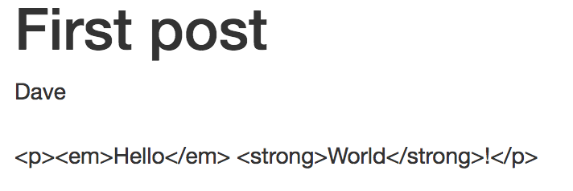

<!-- $size: 16:9 -->
<!--
$theme: gaia
template: invert
-->


REFACTORING ELIXIR FOR MAINTAINABILITY
===
##### By Dave Lucia

---
# ~~REFACTORING ELIXIR FOR MAINTAINABILITY~~
# Leveraging Protocols and Behaviours to write better designed Elixir programs
---

# The Problem

Elixir is a very expressive language that offers syntactic features that are new and exciting when coming from other languages. Beginners tend to overuse features such as pattern matching and multiple function heads because of their novelty, while missing opportunities to make their code more generic and workable. Additionally, powerful language features such as protocols and behaviours are often overlooked due to their relative complexity.


1. Beginners love pattern match, and overuse it
2. Protocols are a higher level concept with unclear applications
3. Behaviours don't seem useful when first starting out, and its unclear when to use them

---
# What will we do for the next 20 minutes?
1. Write some bad code in Phoenix
2. Make it better with Protocols
3. Learn a bit about how Protocols work
4. Make the code EVEN BETTER with behaviours
---

# Who is this guy?


## Dave Lucia

Currently
* Platform Software Architect @ SimpleBet (Elixir + Rust)


Formerly
* Founding team member of The Outline (Elixir + Javascript)
* Bloomberg.com
---
# What got me excited about Elixir?
# Pattern matching is :cool:
```elixir
def foo(%{} = map) do
  # map stuff
end

def foo(atom) when is_atom(atom) do
  # atom stuff
end

def foo("" <> binary) do
  # binary stuff
end
```
---

# TODO write an example of excessive pattern matching
---
# Let's build a blog
---


```elixir
defmodule Blog.Post do
  use Blog.Web, :model
  
  schema “posts” do
    field :title, :string
    field :author, :string
    field :body, :string
  end
end
```

```eex
<article>
  <header>
    <h1><%= @post.title %></h1>
    <address><%= @post.author %></address>
  </header>
  
  <section>
    <%= @post.body %>
  </section>
</article>
```
---
```elixir
defmodule Blog.Web.PostView do
  @moduledoc "View for rendering posts"
  use Blog.Web, :view
  
  alias Blog.Markdown
  def render_markdown(binary) do
    Markdown.to_html(binary)
  end
end

defmodule Blog.Markdown do
  @moduledoc "Utility for rendering markdown -> html"
  def to_html(binary) when is_binary(binary) do
    Cmark.to_html(binary)
  end
  def to_html(_other), do: ""
end
```
---


---

```
iex(2)> Phoenix.View.render(Blog.Web.PostView, "show.html", post: post)
{:safe,
 [[[[[[["" | "<article>\n  <header>\n    <h1>"] | "First post"] |
      "</h1>\n    <address>"] | "Dave"] |
    "</address>\n  </header>\n  <section>\n"] |
   "&lt;p&gt;&lt;em&gt;Hello&lt;/em&gt; &lt;strong&gt;World&lt;/strong&gt;!&lt;/p&gt;\n"] |
  "  </section>\n</article>\n"]}
```
---